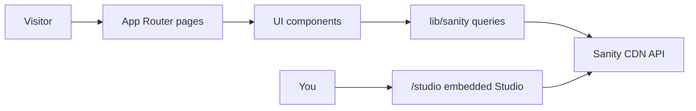

# Edwinspira portfolio implementation plan

## Current state

This repo is a **Cursor + docs scaffold** only: no `package.json`, `app/`, or components. Architecture is already defined in [docs/architecture.md](docs/architecture.md) and CMS/hosting in [docs/decisions.md](docs/decisions.md). [PROJECT_RULES.md](PROJECT_RULES.md) favors small diffs, security, accessibility, and **no new deps unless justified**.

Your choices: **Sanity from day one** and **embedded Studio at `/studio`**.



---

## Target (v1, scoped)

| Area | v1 scope |
|------|----------|
| Brand | Edwinspira name, tagline, `edwinspira.com` metadata |
| Content | Single `work` document type with `category`: `software`, `art`, `video`, `sculpture3d` |
| Pages | Home (hero + featured), `/work` (filterable grid), `/work/[slug]` (detail) |
| Media | Cover image + optional gallery; video via URL embed; 3D via cover + external link (no Three.js) |
| Aesthetic | Dark creative-tech base, strong typography (`next/font`), subtle CSS motion, polished cards |
| Out of scope | Blog, auth, contact API, 3D viewer lib, analytics, rate-limited APIs |

---

## Phase 1 — Bootstrap Next.js (match existing architecture)

Run `create-next-app` **in repo root** (TypeScript, App Router, Tailwind, ESLint, `src` optional—prefer **no `src/`** to match [docs/architecture.md](docs/architecture.md): `/app`, `/components`, `/lib`, `/styles`).

**Create**

| Path | Purpose |
|------|---------|
| `package.json`, `package-lock.json` | Scripts: `dev`, `build`, `lint`, `typecheck` |
| `tsconfig.json`, `next.config.ts`, `postcss.config.mjs`, `eslint.config.mjs` | Tooling |
| `tailwind.config.ts` | Theme tokens (see Phase 4) |
| `app/layout.tsx` | Root layout, fonts, `metadataBase: https://edwinspira.com` |
| `app/globals.css` or `styles/globals.css` | Tailwind + CSS variables |
| `app/page.tsx` | Placeholder home |
| `public/` | `favicon.ico`, placeholder `og-image.png` |

**Change**

| Path | Purpose |
|------|---------|
| [README.md](README.md) | Edwinspira project intro, dev commands, env setup pointer |
| [docs/setup.md](docs/setup.md) | Local install, Sanity project creation, `npm run dev` |
| [.env.example](.env.example) | Replace generic vars with Sanity + site vars (names only) |

**.env.example names** (no values): `NEXT_PUBLIC_SANITY_PROJECT_ID`, `NEXT_PUBLIC_SANITY_DATASET`, `NEXT_PUBLIC_SANITY_API_VERSION`, `SANITY_API_READ_TOKEN` (server-only, for draft/preview if needed later).

---

## Phase 2 — Sanity schema + client + embedded Studio

**Dependencies (justified only)**

- `next-sanity`, `@sanity/image-url` — documented CMS + image URLs
- `sanity`, `@sanity/vision` (dev) — schema + Studio

**Create**

| Path | Purpose |
|------|---------|
| `sanity.config.ts` | Studio config, project/dataset from env |
| `sanity.cli.ts` | CLI for schema deploy |
| `sanity/schemaTypes/index.ts` | Register types |
| `sanity/schemaTypes/work.ts` | Core content model (below) |
| `lib/sanity/client.ts` | Read client (`useCdn: true` in prod) |
| `lib/sanity/image.ts` | `urlFor()` helper |
| `lib/sanity/queries.ts` | GROQ: all works, by slug, featured |
| `lib/sanity/types.ts` | Typed query results |
| `app/studio/[[...tool]]/page.tsx` | Embedded Studio (route group optional) |
| `app/studio/[[...tool]]/layout.tsx` | Minimal layout for Studio |

**`work` schema (minimal fields)**

- `title`, `slug`, `category` (list: software | art | video | sculpture3d)
- `summary` (text), `body` (portable text, optional v1)
- `coverImage`, `gallery[]` (images)
- `videoUrl` (url, for video category embed on detail)
- `externalUrl` (repo, ArtStation, Sketchfab, etc.)
- `featured` (boolean), `sortOrder` (number), `publishedAt` (datetime)

Seed 2–4 sample works in Studio after first deploy (one per category).

**Change**

- [docs/architecture.md](docs/architecture.md) — add `/sanity`, `/app/studio`, and env var list (short)
- [docs/decisions.md](docs/decisions.md) — note embedded Studio decision (one bullet)

No API routes in v1 unless you add ISR revalidation later (`app/api/revalidate/route.ts` + webhook)—defer.

---

## Phase 3 — Site shell + pages

**Create — `lib/site.ts`**

Central config: `siteName: "Edwinspira"`, `domain`, `description`, `navLinks`, default OG copy.

**Create — components** (small, presentational; no CMS logic inside)

| Component | Role |
|-----------|------|
| `components/site-header.tsx` | Logo/wordmark, nav (Home, Work) |
| `components/site-footer.tsx` | Copyright, optional social links from `lib/site.ts` |
| `components/hero.tsx` | Home hero + short positioning line |
| `components/work-card.tsx` | Thumbnail, title, category badge |
| `components/work-grid.tsx` | Responsive grid |
| `components/category-filter.tsx` | Client filter via search params or simple state |
| `components/portable-text.tsx` | Render `body` if used |
| `components/video-embed.tsx` | Safe iframe from `videoUrl` (allowlist hosts) |
| `components/external-link.tsx` | Accessible external links |

**Create — routes**

| Route | Data | Notes |
|-------|------|-------|
| `app/page.tsx` | `featured` works query | Hero + featured grid |
| `app/work/page.tsx` | all works | Category filter |
| `app/work/[slug]/page.tsx` | work by slug | `generateStaticParams` + `notFound()` |
| `app/sitemap.ts`, `app/robots.ts` | site config | `edwinspira.com` URLs |

**Change**

- `app/layout.tsx` — wire Header/Footer, default `metadata` (title template `%s | Edwinspira`, Open Graph)

Use **Server Components** for data fetching; keep client components only for filter/interaction.

---

## Phase 4 — Creative-tech polish (CSS-only)

In `styles/globals.css` + `tailwind.config.ts`:

- **Colors**: near-black background, off-white text, one accent (e.g. electric cyan or violet—pick one)
- **Type**: `next/font` — display + body (e.g. Syne or Space Grotesk + Inter/DM Sans via `next/font/google`, no extra font packages)
- **Motion**: `prefers-reduced-motion` respected; hover lifts on cards via transform/opacity
- **Layout**: generous whitespace, asymmetric hero optional, consistent `max-w-*` container

No Framer Motion / Three.js in v1.

---

## Phase 5 — Deploy + docs

1. Create Sanity project + dataset; add env vars locally and in Vercel.
2. Add `edwinspira.com` in Vercel project settings; set `metadataBase` and Sanity CORS for production origin.
3. `npm run build` locally; fix types/lint per [PROJECT_RULES.md](PROJECT_RULES.md).
4. Optional: minimal smoke test (e.g. Playwright or Vitest) for home renders—only if you want test coverage in v1; otherwise manual checklist in PR.

**Manual test checklist**

- Home shows featured works
- `/work` filters by category
- Detail page: image gallery, video embed, external link
- `/studio` loads for authenticated editing
- Keyboard nav + focus visible on filters/links
- Lighthouse: no secret leakage in client bundle

---

## File manifest summary

### Create (application)

```
package.json, package-lock.json, tsconfig.json, next.config.ts, postcss.config.mjs, eslint.config.mjs, tailwind.config.ts
app/layout.tsx, app/page.tsx, app/globals.css (or styles/globals.css)
app/work/page.tsx, app/work/[slug]/page.tsx
app/studio/[[...tool]]/page.tsx, app/studio/[[...tool]]/layout.tsx
app/sitemap.ts, app/robots.ts
components/site-header.tsx, site-footer.tsx, hero.tsx, work-card.tsx, work-grid.tsx,
  category-filter.tsx, portable-text.tsx, video-embed.tsx, external-link.tsx
lib/site.ts, lib/sanity/client.ts, lib/sanity/image.ts, lib/sanity/queries.ts, lib/sanity/types.ts
sanity.config.ts, sanity.cli.ts
sanity/schemaTypes/index.ts, sanity/schemaTypes/work.ts
public/favicon.ico, public/og-image.png (placeholder)
```

### Change (docs/config)

```
README.md, docs/setup.md, docs/architecture.md, docs/decisions.md, .env.example
```

### Do not change (unless tooling requires)

`.cursor/rules/*`, `PROJECT_RULES.md`, `SECURITY_RULES.md` — behavior already aligned.

---

## Suggested implementation order

1. Next.js + Tailwind scaffold + `lib/site.ts` + layout shell  
2. Sanity schema + client + queries + Studio route  
3. Work pages + components + seed content  
4. Visual polish + metadata/sitemap  
5. Docs + Vercel/Sanity env configuration  

This keeps each PR reviewable and follows the repo’s documented folder patterns without a broad rewrite.
